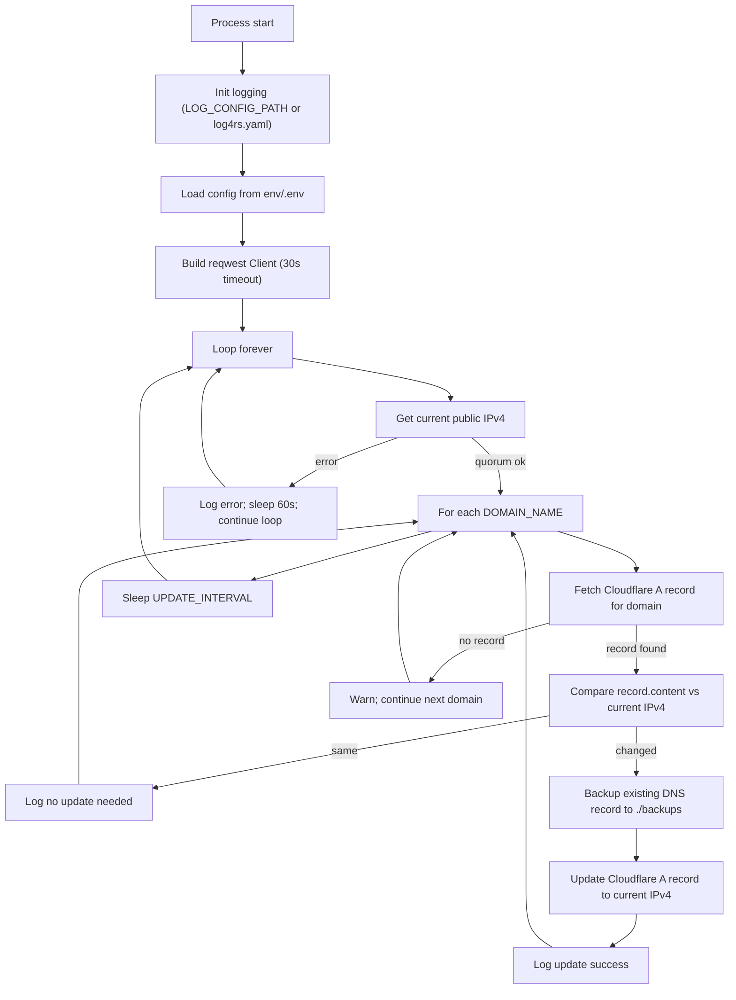
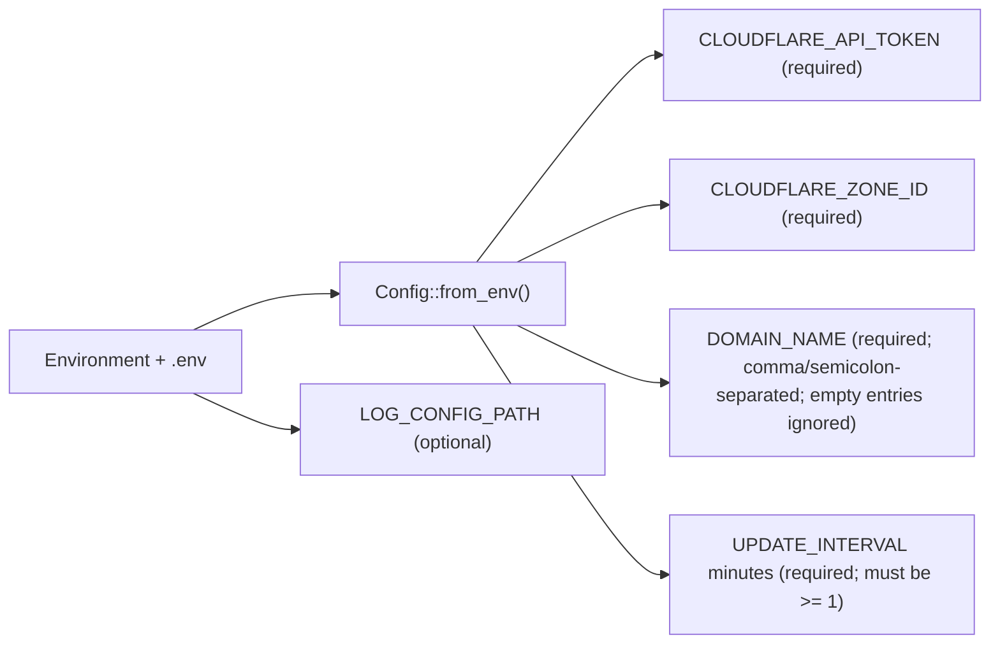
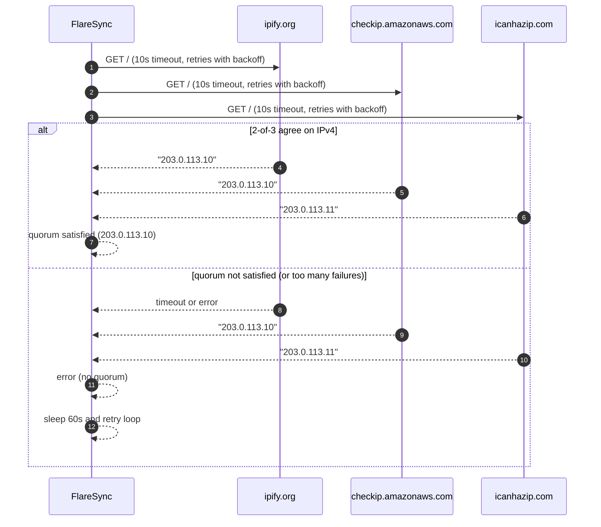
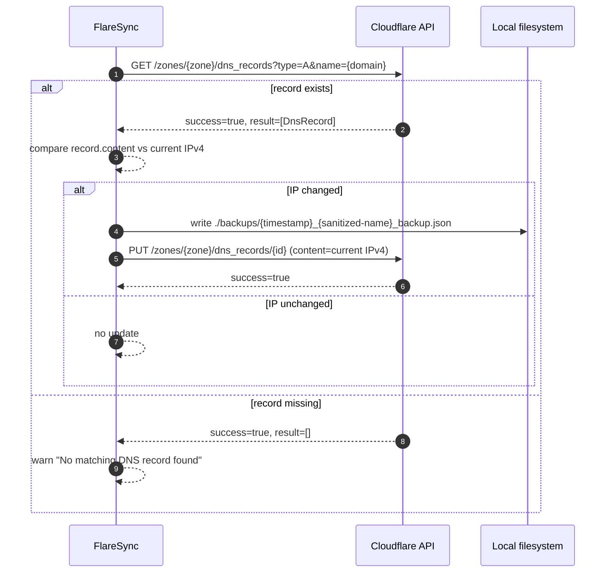
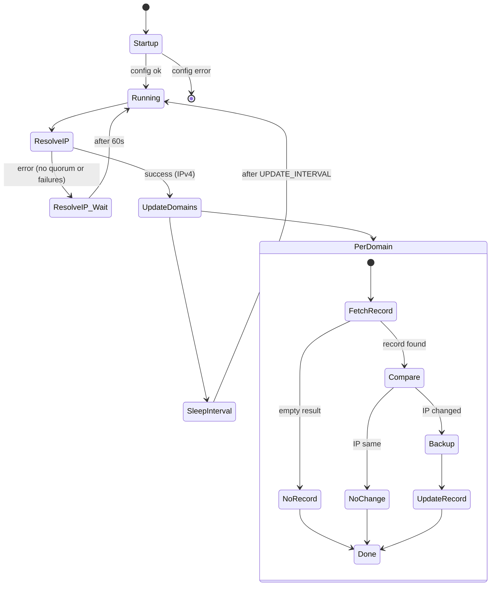
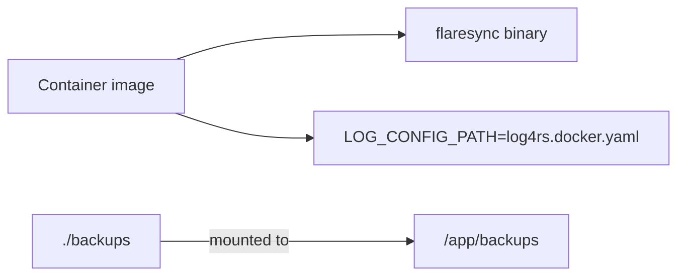

# FlareSync Workflow

This document describes FlareSync’s runtime behavior (control flow, external calls, retries, and side effects) as implemented in the current codebase.

## High-Level Flow

## Inputs and Configuration

- `LOG_CONFIG_PATH` defaults to `log4rs.yaml` if unset.
- `DOMAIN_NAME` may contain multiple entries separated by `,` or `;`. Empty entries are dropped; if all entries are empty, startup fails.
- `UPDATE_INTERVAL` is interpreted as minutes and must be `>= 1`.

## Public IP Discovery (Multi-Source + Quorum)

FlareSync queries multiple public-IP endpoints concurrently and requires agreement by quorum to accept a result.

**Sources (hardcoded)**
- `https://api.ipify.org`
- `https://checkip.amazonaws.com`
- `https://ipv4.icanhazip.com`

**Policy**
- Fetch all three in parallel.
- Accept the IPv4 address only if at least **2 out of 3** sources return the same value.
- If quorum fails, treat as an error and retry later.

**Retry behavior per source**
- Per-attempt timeout: 10 seconds (request and response body).
- Retry up to 3 times with exponential backoff (starting at 1s, doubling, capped).
- Retries trigger on network failures and explicit timeout errors.

## Cloudflare DNS Check/Update

For each configured domain, FlareSync:
1. Fetches the existing **A** record matching that exact name in the given Zone.
2. If a record exists, compares current record IP with current public IPv4.
3. If different, backs up the record JSON to `./backups/` and updates the record via Cloudflare API.
4. If the record is missing, it logs a warning and does not create records.

### URL Encoding

The Cloudflare DNS-record lookup uses a structured query builder (not string concatenation), so the `name=` parameter is URL-encoded correctly for edge cases (e.g., wildcard names like `*.example.com`).

### Backups (Side Effects)

When an update occurs:
- `./backups/` is created if missing.
- The existing DNS record is saved as pretty-printed JSON before the update.
- The filename uses a sanitized version of the record name to avoid unsafe filesystem characters:
  - Allowed: ASCII letters/digits plus `.`, `_`, `-`
  - All other characters become `_`
  - Component is length-capped

## Retry & Error Handling

### Cloudflare retries

Cloudflare requests use bounded exponential backoff retries for transient failures:
- Network/HTTP transient: request-level failures, HTTP `429`, HTTP `5xx`.
- API-level transient: HTTP `200` with `success=false` where `errors` look transient (e.g., Cloudflare code `1015` or messages suggesting rate limiting / temporary issues).

Non-transient Cloudflare API errors fail fast for that domain and FlareSync continues with the next domain.

## Logging

Logging is initialized from:
- `LOG_CONFIG_PATH` if set (Docker image sets this to `log4rs.docker.yaml`)
- Otherwise `log4rs.yaml`

The app logs:
- Startup
- Current public IP
- Per-domain decisions (no record / no change / updated)
- Retry warnings and errors

## Deployment Notes (Docker)

- The container image sets `LOG_CONFIG_PATH=log4rs.docker.yaml` to log to stdout (useful for `docker logs`).
- Backups are typically volume-mounted so they persist across container restarts.
